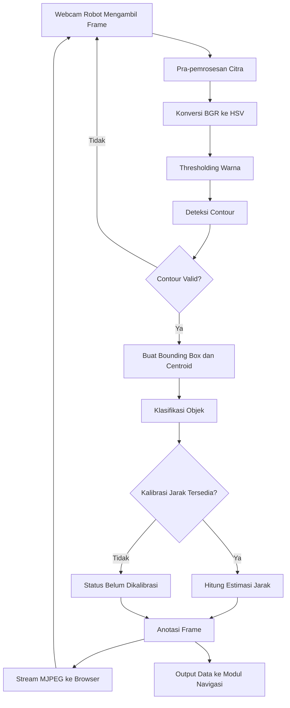
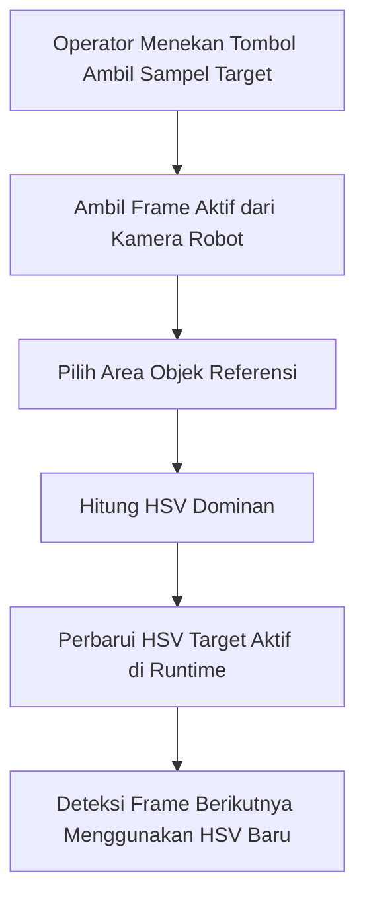
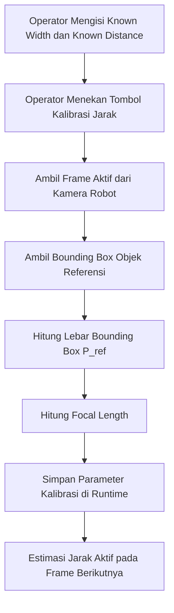

# Product Requirements Document (PRD)
# Modul Visi, Estimasi Jarak, dan Monitoring Berbasis Browser pada Robot Navigasi Otonom

**Nama Proyek:** Robot Navigasi Otonom Berbasis Deteksi Warna dan Penghindaran Rintangan  
**Nama Modul:** Modul Visi, Estimasi Jarak, dan Monitoring  
**Penanggung Jawab Modul:** [Isi nama anggota]  
**Versi Dokumen:** 2.0 (Revisi)  
**Tanggal:** 28 Mei 2026

---

## 1. Ringkasan Produk

Modul ini merupakan subsistem persepsi visual pada robot navigasi otonom yang bertugas menangkap citra dari kamera robot, mendeteksi objek di arena, membedakan objek target dan objek non-target berdasarkan warna, membentuk bounding box pada setiap objek terdeteksi, memperkirakan jarak objek terhadap kamera, serta menampilkan seluruh hasil proses secara real-time melalui antarmuka browser.

Modul ini juga menyediakan fasilitas kalibrasi dinamis melalui GUI berbasis web. Dengan demikian, operator tidak perlu mengubah kode program ketika ingin mengubah warna target atau melakukan kalibrasi ulang estimasi jarak. Semua penyesuaian dilakukan saat sistem berjalan melalui browser yang terhubung ke Raspberry Pi.

Dokumen ini berfungsi sebagai acuan resmi untuk pengembangan, implementasi, integrasi, dan pengujian modul agar proses pengerjaan berjalan terstruktur, konsisten, dan minim miskomunikasi.

---

## 2. Latar Belakang

Robot pada lintasan kompetisi atau pengujian dituntut untuk dapat menemukan area Finish berdasarkan warna tertentu, membedakan objek target dari obstacle atau pengecoh, serta menavigasi arena secara aman. Untuk memenuhi tuntutan tersebut, robot memerlukan subsistem visi yang mampu memberikan informasi visual yang akurat dan dapat diverifikasi.

Permasalahan utama yang hendak dijawab modul ini adalah sebagai berikut:

- Robot perlu melihat dan memahami objek-objek di depannya secara real-time.
- Sistem harus menunjukkan bukti visual proses deteksi agar operator dapat memverifikasi bahwa robot benar-benar sedang mendeteksi objek yang tepat.
- Warna target dapat berubah, sehingga sistem harus mendukung kalibrasi warna secara fleksibel tanpa perubahan kode.
- Estimasi jarak harus tersedia agar objek di arena tidak hanya dikenali, tetapi juga dapat dipahami kedekatannya terhadap kamera robot.
- Operator memerlukan antarmuka monitoring yang mudah diakses dari perangkat lain melalui browser.

Berdasarkan kebutuhan tersebut, modul visi ini dirancang tidak hanya sebagai sistem deteksi warna sederhana, tetapi sebagai pipeline persepsi visual lengkap yang terdiri dari akuisisi citra, analisis objek, estimasi jarak, visualisasi hasil, dan antarmuka kontrol berbasis web.

---

## 3. Tujuan Modul

### 3.1 Tujuan umum

Membangun subsistem kamera robot yang mampu melakukan deteksi objek berbasis warna, estimasi jarak objek dari kamera, serta menyediakan monitoring dan kalibrasi secara real-time melalui browser.

### 3.2 Tujuan khusus

| No | Tujuan | Deskripsi |
|----|--------|-----------|
| 1 | Akuisisi visual | Mengambil frame video real-time dari webcam USB yang terpasang pada robot |
| 2 | Segmentasi warna | Mendeteksi objek target dan objek lain melalui ruang warna HSV |
| 3 | Bounding box | Membentuk bounding box pada seluruh objek relevan yang terdeteksi |
| 4 | Klasifikasi objek | Membagi objek menjadi Target, Obstacle, atau Unknown/Pengecoh |
| 5 | Estimasi jarak | Menghitung jarak objek terhadap kamera berdasarkan ukuran bounding box dan parameter kalibrasi |
| 6 | Monitoring visual | Menampilkan seluruh hasil deteksi melalui live stream berbasis browser |
| 7 | Kalibrasi runtime | Memungkinkan operator melakukan kalibrasi warna target dan estimasi jarak tanpa mengubah kode |
| 8 | Integrasi sistem | Menyediakan output data objek yang dapat dikonsumsi modul navigasi |

---

## 4. Ruang Lingkup Modul

### 4.1 Termasuk dalam ruang lingkup

Modul ini mencakup seluruh komponen berikut:

- Akuisisi video dari webcam robot.
- Pra-pemrosesan citra.
- Konversi warna ke HSV.
- Thresholding warna target dan non-target.
- Deteksi kontur.
- Pembentukan bounding box dan centroid.
- Klasifikasi objek.
- Estimasi jarak dari kamera ke objek.
- Overlay hasil deteksi pada frame.
- Streaming MJPEG ke browser.
- GUI browser untuk monitoring.
- GUI browser untuk kalibrasi warna target.
- GUI browser untuk kalibrasi jarak.
- Penyediaan data objek untuk modul lain.

### 4.2 Tidak termasuk dalam ruang lingkup

Modul ini tidak mencakup:

- Pengolahan data HC-SR04 sebagai logika utama modul.
- Pengambilan keputusan navigasi robot.
- Kendali motor, PWM, atau manuver roda.
- Algoritma obstacle avoidance final.
- Penyimpanan cloud, database, atau kontrol jarak jauh berbasis internet.

---

## 5. Pemangku Kepentingan

| Pihak | Kepentingan |
|------|-------------|
| Anggota penanggung jawab modul visi | Mengimplementasikan modul sesuai spesifikasi |
| Tim navigasi robot | Menerima data objek dan jarak dari modul visi |
| Dosen / pembimbing | Menilai kejelasan desain, validitas logika, dan implementasi |
| Operator pengujian | Mengakses browser untuk monitoring dan kalibrasi |
| Tim integrasi | Menggabungkan modul visi dengan sensor dan aktuator lain |

---

## 6. Teknologi yang Digunakan

### 6.1 Hardware

| Komponen | Fungsi |
|----------|--------|
| Raspberry Pi | Pusat komputasi utama untuk menjalankan OpenCV dan Flask |
| Webcam USB | Sumber frame visual utama dari arena |
| HC-SR04 | Sensor jarak pendukung / pembanding (opsional untuk validasi) |
| Baterai | Sumber daya sistem |
| Sasis robot + motor DC + L298N | Platform gerak robot (di luar tanggung jawab modul ini) |

### 6.2 Software dan library

| Teknologi | Fungsi |
|-----------|--------|
| Python 3 | Bahasa pemrograman utama |
| OpenCV | Akuisisi frame, HSV, contour detection, bounding box, anotasi |
| NumPy | Operasi array dan manipulasi parameter numerik |
| Flask | Web framework untuk GUI dan API endpoint |
| HTML | Struktur antarmuka browser |
| CSS | Tampilan antarmuka browser |
| JavaScript | Interaksi form, update status, dan komunikasi dengan endpoint Flask |
| MJPEG | Format streaming frame ke browser |

### 6.3 Alasan pemilihan teknologi

- OpenCV dipilih karena mendukung operasi citra real-time yang sesuai untuk Raspberry Pi.
- HSV dipilih karena lebih stabil terhadap perubahan pencahayaan dibanding pemrosesan warna langsung di RGB/BGR.
- Flask dipilih karena ringan, mudah diintegrasikan dengan Python, dan cukup untuk kebutuhan GUI lokal.
- Browser dipilih sebagai media monitoring karena dapat diakses dari laptop atau HP tanpa instalasi aplikasi tambahan.

---

## 7. Asumsi Sistem

Agar modul bekerja sesuai desain, terdapat beberapa asumsi yang disepakati:

- Kamera robot aktif dan terhubung stabil ke Raspberry Pi.
- Objek target memiliki ukuran nyata yang dapat diketahui saat proses kalibrasi jarak.
- Operator dapat mengukur jarak referensi secara manual saat melakukan kalibrasi awal.
- Koneksi browser dilakukan dalam jaringan lokal yang sama dengan Raspberry Pi.
- Arena memiliki pencahayaan yang masih memungkinkan warna target dibedakan secara visual.
- Objek yang diukur jaraknya cukup terlihat di frame dan tidak terpotong secara ekstrem.

---

## 8. Arsitektur Sistem Tingkat Tinggi

```
[Webcam USB Robot]
        |
        v
[Akuisisi Frame]
        |
        v
[Pra-pemrosesan Citra]
        |
        v
[Deteksi Warna & Segmentasi]
        |
        v
[Deteksi Kontur]
        |
        v
[Bounding Box + Centroid]
        |
        v
[Klasifikasi Objek]
        |
        +-----------------------------+
        |                             |
        v                             v
[Estimasi Jarak]             [Data Objek untuk Navigasi]
        |
        v
[Anotasi Frame]
        |
        v
[Flask Streaming Server]
        |
        v
[Browser Operator]
        |
        +-----------------------------+
        |                             |
        v                             v
[Monitoring Visual]         [Kalibrasi Warna & Jarak]
```

---

## 9. Arsitektur Software Internal

Agar pengembangan lebih rapi, kode program harus dibagi menjadi beberapa modul. Modul-modul berikut direkomendasikan sebagai struktur implementasi.

| Nama Modul/File | Tanggung Jawab |
|-----------------|----------------|
| `app.py` | Menjalankan Flask app utama dan mendaftarkan route |
| `camera_manager.py` | Mengelola webcam, membuka stream, mengambil frame terbaru |
| `image_processor.py` | Resize, blur, konversi ke HSV, masking, operasi morfologi |
| `object_detector.py` | Menemukan contour, membuat bounding box, menghitung centroid |
| `classifier.py` | Menentukan label objek: Target, Obstacle, Unknown |
| `distance_estimator.py` | Menyimpan parameter kalibrasi jarak dan menghitung estimasi jarak |
| `calibration_service.py` | Menangani kalibrasi warna dan kalibrasi jarak dari browser |
| `stream_service.py` | Menggambar overlay dan mengubah frame menjadi stream MJPEG |
| `state_manager.py` | Menyimpan state runtime: HSV aktif, focal length, known width, status kalibrasi |
| `config.py` | Menyimpan konfigurasi default sistem |
| `templates/index.html` | Antarmuka browser |
| `static/style.css` | Tampilan GUI |
| `static/app.js` | Interaksi frontend dan AJAX ke Flask |

---

## 10. Struktur Folder yang Direkomendasikan

```text
robot_vision_module/
├── app.py
├── config.py
├── camera_manager.py
├── image_processor.py
├── object_detector.py
├── classifier.py
├── distance_estimator.py
├── calibration_service.py
├── stream_service.py
├── state_manager.py
├── templates/
│   └── index.html
├── static/
│   ├── style.css
│   └── app.js
└── requirements.txt
```

---

## 11. Alur Data Sistem

## 11A. Flowchart Visual Sistem

### 11A.1 Flowchart alur utama



### 11A.2 Flowchart kalibrasi warna target



### 11A.3 Flowchart kalibrasi jarak




### 11.1 Alur utama runtime

1. Webcam robot menangkap frame arena.
2. Frame diteruskan ke pipeline pemrosesan citra.
3. Sistem melakukan resize, blur, dan konversi ke HSV.
4. Thresholding diterapkan untuk menghasilkan mask warna target dan non-target.
5. Kontur pada mask dicari dan difilter berdasarkan area minimum.
6. Setiap kontur valid diubah menjadi bounding box.
7. Label objek ditentukan berdasarkan kecocokan warna.
8. Jika parameter kalibrasi tersedia, estimasi jarak dihitung.
9. Hasil digambar pada frame sebagai anotasi visual.
10. Frame teranotasi dikirim ke browser melalui MJPEG stream.
11. Data objek dikirim ke modul navigasi sebagai output data.

### 11.2 Alur kalibrasi warna

1. Operator membuka GUI browser.
2. Operator menekan tombol "Ambil Sampel Target".
3. Sistem membaca frame aktif dari kamera robot.
4. Sistem memilih area objek yang akan dijadikan referensi warna.
5. Sistem menghitung HSV dominan atau rata-rata dari area itu.
6. Rentang HSV target diperbarui di runtime.
7. Deteksi frame berikutnya langsung memakai warna target baru.

### 11.3 Alur kalibrasi jarak

1. Operator meletakkan objek target pada jarak yang sudah diukur manual.
2. Operator membuka GUI browser.
3. Operator memasukkan `Known_Width` dan `Known_Distance`.
4. Sistem membaca `P_ref` dari bounding box objek target pada frame aktif.
5. Sistem menghitung focal length.
6. Nilai kalibrasi disimpan di state runtime.
7. Frame berikutnya langsung menampilkan estimasi jarak.

---

## 12. Kebutuhan Fungsional

### FR-01 Akuisisi citra
Sistem harus mampu mengambil frame video secara terus-menerus dari webcam yang terpasang pada robot.

### FR-02 Pra-pemrosesan citra
Sistem harus melakukan resize dan konversi warna ke HSV sebelum proses deteksi objek dilakukan.

### FR-03 Deteksi warna target
Sistem harus mampu mendeteksi objek target berdasarkan rentang HSV target yang aktif.

### FR-04 Deteksi objek non-target
Sistem harus tetap mampu mendeteksi objek lain yang relevan di arena agar kondisi target tertutup dapat tetap dianalisis.

### FR-05 Bounding box
Sistem harus membentuk bounding box pada setiap objek yang lolos ambang area minimum.

### FR-06 Klasifikasi objek
Sistem harus mengklasifikasikan objek menjadi `TARGET`, `OBSTACLE`, atau `UNKNOWN`.

### FR-07 Estimasi jarak
Sistem harus menghitung estimasi jarak kamera ke objek menggunakan parameter kalibrasi yang dimasukkan operator.

### FR-08 Annotated stream
Sistem harus menampilkan live stream hasil anotasi ke browser.

### FR-09 Kalibrasi warna dari browser
Sistem harus memungkinkan operator melakukan kalibrasi warna target saat runtime melalui GUI browser tanpa mengubah kode program.

### FR-10 Kalibrasi jarak dari browser
Sistem harus memungkinkan operator memasukkan parameter kalibrasi jarak melalui GUI browser tanpa restart sistem.

### FR-11 Output data objek
Sistem harus menyediakan data objek (label, posisi, ukuran box, jarak) untuk dipakai modul lain.

### FR-12 Status sistem
Sistem harus menampilkan status sistem seperti target aktif, status kalibrasi, dan jumlah objek terdeteksi.

---

## 13. Kebutuhan Non-Fungsional

| Kode | Kebutuhan | Deskripsi |
|------|-----------|-----------|
| NFR-01 | Kinerja | Sistem diharapkan memproses video secara near real-time |
| NFR-02 | Keterbacaan | Hasil deteksi pada stream harus mudah dibaca operator |
| NFR-03 | Maintainability | Kode harus modular dan tidak ditulis dalam satu file besar |
| NFR-04 | Reconfigurability | Parameter kalibrasi dapat diubah saat runtime tanpa ubah kode |
| NFR-05 | Reliability | Jika browser ditutup, proses deteksi inti tetap berjalan |
| NFR-06 | Local accessibility | GUI dapat diakses dari perangkat lain pada jaringan lokal |
| NFR-07 | Scalability internal | Modul harus mudah ditambah fitur lain di kemudian hari |
| NFR-08 | Debuggability | Sistem harus cukup transparan untuk proses debugging visual |

---

## 14. Detail Logika Estimasi Jarak

### 14.1 Metode yang digunakan

Metode utama estimasi jarak menggunakan pendekatan Triangle Similarity.

### 14.2 Data kalibrasi yang diperlukan

| Parameter | Sumber |
|-----------|--------|
| `Known_Width` | Dimasukkan operator dari ukuran nyata objek |
| `Known_Distance` | Dimasukkan operator dari pengukuran manual |
| `P_ref` | Dibaca dari bounding box objek target pada frame aktif |

### 14.3 Rumus

Kalibrasi focal length:

```text
F = (P_ref × D_known) / W_real
```

Estimasi jarak objek baru:

```text
Distance = (W_real × F) / P_frame
```

### 14.4 Keluaran estimasi jarak

Untuk tiap objek, sistem menampilkan:

- `label objek`
- `width_px`
- `height_px`
- `distance_cm` (jika kalibrasi tersedia)

### 14.5 Keterbatasan metode

- Akurasi turun jika objek diputar ekstrem atau tidak menghadap kamera dengan baik.
- Akurasi terbaik diperoleh untuk objek dengan ukuran serupa terhadap objek referensi saat kalibrasi.
- Jika objek target tidak terdeteksi saat kalibrasi jarak, sistem tidak boleh menghitung focal length.

---

## 15. Detail GUI Browser

### 15.1 Fungsi utama GUI

GUI browser memiliki dua fungsi utama:

- Monitoring hasil kerja sistem.
- Mengirim perintah kalibrasi ke Raspberry Pi.

### 15.2 Komponen GUI

| Komponen | Fungsi |
|----------|--------|
| Panel video | Menampilkan live stream hasil anotasi |
| Panel status | Menampilkan target aktif, jumlah objek, dan status kalibrasi |
| Tombol Ambil Sampel Target | Mengkalibrasi warna target dari frame kamera robot |
| Form Known Width | Mengisi ukuran nyata objek |
| Form Known Distance | Mengisi jarak referensi objek |
| Tombol Kalibrasi Jarak | Menghitung dan menyimpan focal length |
| Panel daftar objek | Menampilkan daftar objek yang terdeteksi dan jaraknya |

### 15.3 Prinsip penting GUI

- GUI hanya bertindak sebagai antarmuka dan pengirim perintah.
- Sumber gambar tetap berasal dari kamera robot, bukan kamera perangkat operator.
- Kalibrasi yang dilakukan dari browser harus langsung memakai frame aktif dari kamera robot.

---

## 16. API / Endpoint yang Dibutuhkan

| Endpoint | Method | Fungsi |
|----------|--------|--------|
| `/` | GET | Menampilkan halaman utama GUI |
| `/video_feed` | GET | Mengirim live stream MJPEG |
| `/api/status` | GET | Mengembalikan status runtime sistem |
| `/api/objects` | GET | Mengembalikan daftar objek yang terdeteksi |
| `/api/calibrate-color` | POST | Menjalankan kalibrasi warna target dari frame aktif |
| `/api/calibrate-distance` | POST | Menjalankan kalibrasi jarak menggunakan form input |
| `/api/config` | GET | Mengambil konfigurasi aktif |
| `/api/config` | POST | Memperbarui konfigurasi runtime tertentu |

---

## 17. State Runtime yang Harus Disimpan

| Nama State | Deskripsi |
|------------|-----------|
| `target_hsv_lower` | Batas bawah HSV target aktif |
| `target_hsv_upper` | Batas atas HSV target aktif |
| `obstacle_hsv_lower` | Batas bawah HSV obstacle |
| `obstacle_hsv_upper` | Batas atas HSV obstacle |
| `known_width_cm` | Lebar nyata objek referensi |
| `known_distance_cm` | Jarak referensi saat kalibrasi |
| `focal_length_px` | Nilai focal length hasil kalibrasi |
| `calibration_status` | Menandakan apakah sistem sudah dikalibrasi |
| `detected_objects` | Daftar objek yang sedang terdeteksi |

---

## 18. Pseudocode Logika Inti

```text
LOOP utama:
  ambil frame dari kamera robot
  lakukan resize dan blur
  konversi frame ke HSV
  buat mask target dan mask obstacle
  lakukan morfologi untuk kurangi noise
  cari contour dari setiap mask
  untuk setiap contour valid:
      hitung bounding box
      hitung centroid
      ambil width_px dan height_px
      tentukan label objek
      jika focal_length tersedia:
          hitung jarak
      jika belum:
          set status belum dikalibrasi
      gambar bounding box dan label di frame
      simpan data objek ke daftar output
  kirim frame ke stream MJPEG
  update status runtime
```

```text
Saat tombol Ambil Sampel Target ditekan:
  ambil frame aktif dari kamera robot
  pilih area objek referensi
  hitung HSV dominan
  simpan HSV target baru ke runtime state
```

```text
Saat tombol Kalibrasi Jarak ditekan:
  baca Known_Width dan Known_Distance dari browser
  ambil objek target dari frame aktif
  baca P_ref dari bounding box target
  hitung focal length
  simpan focal length di runtime state
```

---

## 19. Acceptance Criteria

Modul dianggap berhasil jika memenuhi seluruh kriteria berikut:

| Kode | Acceptance Criteria |
|------|---------------------|
| AC-01 | Kamera robot dapat menampilkan live stream di browser |
| AC-02 | Objek target dapat terdeteksi dan diberi bounding box |
| AC-03 | Obstacle atau objek lain juga dapat diberi bounding box |
| AC-04 | Label target dan obstacle tampil dengan benar pada stream |
| AC-05 | Operator dapat melakukan kalibrasi warna dari browser |
| AC-06 | Operator dapat melakukan kalibrasi jarak dari browser |
| AC-07 | Setelah kalibrasi jarak, nilai jarak tampil pada objek yang terdeteksi |
| AC-08 | Kalibrasi dapat diulang tanpa restart program |
| AC-09 | Browser hanya menjadi antarmuka; sumber citra tetap dari kamera robot |
| AC-10 | Data objek dapat dikirim ke modul lain untuk integrasi |

---

## 20. Risiko Teknis dan Mitigasi

| Risiko | Dampak | Mitigasi |
|--------|--------|----------|
| Cahaya berubah drastis | HSV gagal mendeteksi target | Sediakan kalibrasi warna ulang dari browser |
| Bounding box tidak stabil | Jarak jadi fluktuatif | Gunakan smoothing atau averaging beberapa frame |
| Objek terlalu kecil | Deteksi gagal | Tentukan area minimum deteksi |
| Raspberry Pi terlalu berat | FPS menurun | Kurangi resolusi, sederhanakan pipeline |
| Target tertutup obstacle | Target hilang sementara | Tetap deteksi obstacle dan tampilkan objek lain |
| Kalibrasi salah input | Jarak salah | Tambahkan validasi form dan pesan status kalibrasi |
| Browser terputus | Operator kehilangan monitoring | Pastikan proses inti tetap berjalan tanpa browser |

---

## 21. Rencana Pengujian

### 21.1 Uji fungsional dasar

- Uji apakah webcam terbaca.
- Uji apakah stream muncul di browser.
- Uji apakah tombol kalibrasi warna bekerja.
- Uji apakah tombol kalibrasi jarak bekerja.

### 21.2 Uji deteksi objek

- Objek target tunggal pada berbagai posisi.
- Obstacle tunggal pada berbagai posisi.
- Beberapa objek sekaligus.
- Target tertutup sebagian oleh obstacle.

### 21.3 Uji estimasi jarak

- Objek pada beberapa jarak referensi tetap.
- Perbandingan antara jarak estimasi dan jarak manual.
- Uji setelah kalibrasi ulang.

### 21.4 Uji performa

- Uji FPS sistem pada beberapa resolusi.
- Uji delay browser di jaringan lokal.
- Uji beban saat stream dan deteksi aktif bersamaan.

### 21.5 Uji integrasi

- Pastikan data objek dapat dibaca modul navigasi.
- Pastikan modul tetap bekerja saat GUI dibuka dan ditutup berulang kali.

---

## 22. Tahapan Implementasi yang Disarankan

| Tahap | Fokus |
|------|-------|
| Tahap 1 | Akuisisi frame dan stream dasar ke browser |
| Tahap 2 | HSV thresholding dan bounding box |
| Tahap 3 | Klasifikasi target dan obstacle |
| Tahap 4 | Kalibrasi warna dari browser |
| Tahap 5 | Kalibrasi jarak dan estimasi jarak |
| Tahap 6 | API status dan daftar objek |
| Tahap 7 | Integrasi output ke modul navigasi |
| Tahap 8 | Pengujian dan tuning akhir |

---

## 23. Hubungan dengan Modul Lain

| Modul Lain | Bentuk Hubungan |
|------------|-----------------|
| Modul navigasi | Mengonsumsi data centroid, label, dan jarak objek |
| Modul motor | Tidak terhubung langsung; melalui navigasi |
| Modul ultrasonik | Dapat dipakai sebagai pembanding tambahan bila diperlukan |
| Modul GUI/operator | Mengakses stream dan mengirim perintah kalibrasi |


## 23A. Spesifikasi Format Output ke Modul Navigasi

Agar integrasi dengan modul navigasi lebih jelas, modul visi harus menghasilkan output data objek dalam format terstruktur. Format yang direkomendasikan adalah dictionary Python atau JSON.

### 23A.1 Struktur data per objek

```python
{
    "id": 1,
    "label": "TARGET",
    "bbox": {
        "x": 120,
        "y": 80,
        "w": 95,
        "h": 110
    },
    "centroid": {
        "cx": 167,
        "cy": 135
    },
    "width_px": 95,
    "height_px": 110,
    "distance_cm": 42.8,
    "confidence_color": 0.91,
    "frame_time": "2026-05-28T12:30:15"
}
```

### 23A.2 Struktur data keseluruhan frame

```json
{
  "frame_id": 152,
  "timestamp": "2026-05-28T12:30:15",
  "calibration_status": true,
  "target_hsv": {
    "lower": [35, 80, 70],
    "upper": [85, 255, 255]
  },
  "objects": [
    {
      "id": 1,
      "label": "TARGET",
      "bbox": {"x": 120, "y": 80, "w": 95, "h": 110},
      "centroid": {"cx": 167, "cy": 135},
      "width_px": 95,
      "height_px": 110,
      "distance_cm": 42.8
    },
    {
      "id": 2,
      "label": "OBSTACLE",
      "bbox": {"x": 250, "y": 90, "w": 60, "h": 85},
      "centroid": {"cx": 280, "cy": 132},
      "width_px": 60,
      "height_px": 85,
      "distance_cm": 67.5
    }
  ]
}
```

### 23A.3 Penjelasan field output

| Field | Tipe | Keterangan |
|-------|------|------------|
| `frame_id` | integer | Nomor frame saat data dihasilkan |
| `timestamp` | string | Waktu pengambilan data |
| `calibration_status` | boolean | Menandakan apakah estimasi jarak sudah aktif |
| `label` | string | Kelas objek: TARGET, OBSTACLE, UNKNOWN |
| `bbox.x` | integer | Koordinat kiri bounding box |
| `bbox.y` | integer | Koordinat atas bounding box |
| `bbox.w` | integer | Lebar bounding box dalam piksel |
| `bbox.h` | integer | Tinggi bounding box dalam piksel |
| `centroid.cx` | integer | Koordinat x titik tengah objek |
| `centroid.cy` | integer | Koordinat y titik tengah objek |
| `distance_cm` | float | Estimasi jarak objek ke kamera dalam cm |
| `confidence_color` | float | Skor kecocokan warna objek terhadap kelas yang diberikan |

### 23A.4 Aturan integrasi ke navigasi

- Modul navigasi membaca daftar `objects` dari frame terbaru.
- Prioritas utama dapat diambil dari objek dengan label `TARGET`.
- Jika target tidak ada, navigasi dapat membaca objek `OBSTACLE` terdekat berdasarkan `distance_cm`.
- Jika `calibration_status = false`, modul navigasi tetap dapat menggunakan posisi centroid dan label, tetapi tidak boleh mengandalkan `distance_cm` sebagai acuan utama.
- Field `bbox`, `centroid`, dan `distance_cm` wajib tersedia untuk setiap objek valid.

---

## 24. Penutup

Dokumen PRD revisi ini menjadi acuan kerja resmi untuk pengembangan Modul Visi, Estimasi Jarak, dan Monitoring pada robot navigasi otonom. Seluruh desain di dalam dokumen telah disusun agar implementasi dapat dilakukan secara bertahap, modular, dan dapat dipahami oleh seluruh anggota tim. Dengan dokumen ini, setiap bagian pekerjaan diharapkan menjadi lebih jelas, lebih terukur, dan lebih mudah diintegrasikan dengan subsistem robot lainnya.
